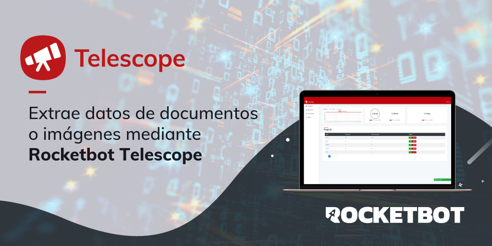

# Rocketbot Telescope
  
Módulo para Rocketbot Telescope  

*Read this in other languages: [English](Manual_Telescope.md), [Português](Manual_Telescope.pr.md), [Español](Manual_Telescope.es.md)*
  

## Como instalar este módulo
  
Para instalar el módulo en Rocketbot Studio, se puede hacer de dos formas:
1. Manual: __Descargar__ el archivo .zip y descomprimirlo en la carpeta modules. El nombre de la carpeta debe ser el mismo al del módulo y dentro debe tener los siguientes archivos y carpetas: \__init__.py, package.json, docs, example y libs. Si tiene abierta la aplicación, refresca el navegador para poder utilizar el nuevo modulo.
2. Automática: Al ingresar a Rocketbot Studio sobre el margen derecho encontrara la sección de **Addons**, seleccionar **Install Mods**, buscar el modulo deseado y presionar install.  

## Como usar este modulo

Para usar este modulo usted debe:

1. Crear proyecto
2. Generar la plantilla
   1. Toma un punto de referencia.
   2. Seleccione los datos que desea extraer.
   3. Guarde la Plantilla.
   4. Cargue y procese un archivo.
   5. Verifique los datos extraídos.
3. Guarde el token generado para la plantilla
4. Crear un archivo denominado telescope.ini que contenga:
   [USER]
   user = aaaa@rocketbot.cl
   password = robot1111
   server = http://11.11.1.111/

## Descripción de los comandos

### Login Telescope
  
Comando para conectarse a Telescope
|Parámetros|Descripción|ejemplo|
| --- | --- | --- |
|Ruta Archivo .ini|Selecciona el archivo .ini para conectarse|C:/Users/User/Desktop/archivo.ini|

### Subir documento
  
Subir documento para obtener texto
|Parámetros|Descripción|ejemplo|
| --- | --- | --- |
|Seleccionar archivo|Selecciona el documento a subir para obtener el texto|C:/Users/User/Desktop/documento.jpg|
|Template token|Token de Template en Telescope|RCKU2GKCUP4XB5VW|
|Asignar a variable|Variable donde se guardará el texto obtenido|var|

### Subir documentos
  
Subir multiples documentos para obtener texto
|Parámetros|Descripción|ejemplo|
| --- | --- | --- |
|Seleccionar carpeta|Selecciona la carpeta donde se encuentran los documentos a subir|C:/Users/User/Desktop/carpeta|
|Template ID|ID de Template en Telescope|RCKU2GKCUP4XB5VW|
|Asignar a variable|Variable donde se guardará el contenido de los documentos|var|

### Consultar estado de resultado
  
Devuelve el estado de un resultado
|Parámetros|Descripción|ejemplo|
| --- | --- | --- |
|Token de resultado|Token de resultado de un proceso de extracción de texto|4YLXHLLD4IXM621P|
|Asignar a variable|Variable donde se guardará el resultado de la consulta|var|

### Obtener resultado
  
Obtener información de un resultado
|Parámetros|Descripción|ejemplo|
| --- | --- | --- |
|Token de resultado|Token de resultado de un proceso de extracción de texto|RCKU2GKCUP4XB5VW|
|Guardar resultado en variable|Variable donde se guardará el resultado||
